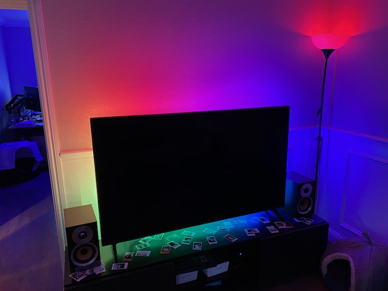

# homekit-neopixel-rpi
homekit-neopixel-rpi 

[Demo Video](https://youtu.be/IMnxmEtBPBE)



## You need

Hardware:

  Raspberry Pi
  Neopixel strip

Software

  homebridge on Raspberry Pi
  python3
  nodejs


### Install 

```
sudo npm install -g pm2 homebridge homebridge-neopixel --unsafe-perm
```


### setting
```
# .homebridge/config
# add 
{
    "accessory": "HttpPushRgb",
    "name": "Neo Lamp2",
    "service": "Light",
    "switch": {
        "status": "http://localhost:5000/status",
        "powerOn": "http://localhost:5000/on",
        "powerOff": "http://localhost:5000/off"
    },
    "brightness": {
        "status": "http://localhost:5000/bright",
        "url": "http://localhost:5000/setbright/%s"
    },
    "color": {
        "status": "http://localhost:5000/color",
        "url": "http://localhost:5000/set/%s",
        "brightness": false
    }
},
{
    "accessory": "HttpPushRgb",
    "name": "Neo Rainbow2",
    "service": "Light",
    "switch": {
        "status": "http://localhost:5000/status",
        "powerOn": "http://localhost:5000/rainbow",
        "powerOff": "http://localhost:5000/off"
    },
    "brightness": {
        "status": "http://localhost:5000/bright",
        "url": "http://localhost:5000/setbright/%s"
    }
}
```

### Start the homebridge
```
pm2 start homebridge
```

### Start the server
```python
sudo FLASK_APP=server.py flask run
```

### Planned Changes/TODO

* Split brightness functionality out so it's not tethered to color codes. This will allow changing the brightness of patterns - *DONE*, not very elegantly. It currently requires brightness computation to be done in *each* pattern's color "fetch" method, IE, the wheel method for rainbows.
* Configure device notifications so that when a pattern "device" is activated, other devices turn off and notify HomeBridge of this change.
* Figure out what's up with the threads. Currently if you turn on the rainbow device, then tinker with the standard device, two different threads simultaneously communicate with the LED strip. It looks like there are some checks to handle this already, but it seems to take too long. I might have to kill the thread? - Some progress made here. I used a loop structure instead of constantly pushing more function calls on the stack recursively.
* Add more patterns
* Ensure migration to [HomeBridge HTTP RGB Push](https://github.com/QuickSander/homebridge-http-rgb-push) is working as expected.

[homebridge neopixel](https://www.studiopieters.nl/homebridge-neopixel-light/)
[RPi neipixel](https://learn.adafruit.com/neopixels-on-raspberry-pi/raspberry-pi-wiring)
