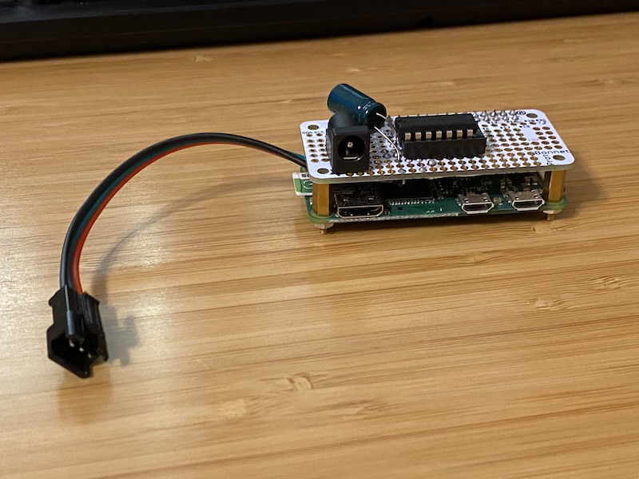

# homekit-neopixel-rpi
homekit-neopixel-rpi 

[Demo Video](https://youtu.be/IMnxmEtBPBE)


## You need

Hardware:

  - Raspberry Pi (I used a Zero W)
  - Neopixel strip
  - Level Shifter
  - Capacitor

See Adafruit's [NeoPixels on Raspberry Pi](https://learn.adafruit.com/neopixels-on-raspberry-pi/overview) guide for more information on the level shifter and capacitor. You can also overachieve like I did and use a proto board (I used the ProtoBonnet from Adafruit) and soldered on the appropriate JST-SM connectors that are commonly used on NeoPixel strips. If you're like me and will be annoyed by having to power the Raspberry Pi and the NeoPixels separately, you can actually just use a 2.1mm DC barrel connector and also power your Raspberry Pi from this. The Pi Zero lacks circuit protection anyway, so you don't lose anything by powering it via GPIO. The non-Zero Raspberry Pis do have circuit protection (or at least modern iterations, I did not research older variants) and you may not want to sacrifice the circuit protection.



Software:

  homebridge on Raspberry Pi
  python3
  nodejs


### Install 

See the official documentation for [Installing Homebridge on Raspbian](https://github.com/homebridge/homebridge/wiki/Install-Homebridge-on-Raspbian). I recommend following their documentation instead of the recs I had here before, as you can get a pretty web interface (Homebridge Config UI) that makes it much easier to change your config files than was the case when I started this project about a year ago (I originally gave up on implementing patterns and had opted for a solution that could talk to both analog and NeoPixel LEDs by just calling out to the shell, but then decided I really wanted patterns and forked the upstream code). They even have an already baked Raspbian image.

Regardless of whether you use the pre-baked Raspbian image or not, you will need to install the [Adafruit NeoPixel Library](https://learn.adafruit.com/neopixels-on-raspberry-pi/python-usage).

You'll want to change `num_pixels` and `pixel_pin` to match your configuration.

You'll also need the "HttpPushRgb" Homebridge package.

### Config.json
You will need the `bridge` section in your JSON for Homebridge to work properly. See https://github.com/homebridge/homebridge/blob/master/config-sample.json for more context. 
```
# .homebridge/config
# add 
{
    "accessory": "HttpPushRgb",
    "name": "Neo Lamp2",
    "service": "Light",
    "switch": {
        "status": "http://localhost:5000/status",
        "powerOn": "http://localhost:5000/on",
        "powerOff": "http://localhost:5000/off"
    },
    "brightness": {
        "status": "http://localhost:5000/bright",
        "url": "http://localhost:5000/setbright/%s"
    },
    "color": {
        "status": "http://localhost:5000/color",
        "url": "http://localhost:5000/set/%s",
        "brightness": false
    }
},
{
    "accessory": "HttpPushRgb",
    "name": "Neo Rainbow2",
    "service": "Light",
    "switch": {
        "status": "http://localhost:5000/status",
        "powerOn": "http://localhost:5000/rainbow",
        "powerOff": "http://localhost:5000/off"
    },
    "brightness": {
        "status": "http://localhost:5000/bright",
        "url": "http://localhost:5000/setbright/%s"
    }
}
```

### Start the server
```python
sudo FLASK_APP=server.py flask run
```

### Planned Changes/TODO

* Split brightness functionality out so it's not tethered to color codes. This will allow changing the brightness of patterns - *DONE*, not very elegantly. It currently requires brightness computation to be done in *each* pattern's color "fetch" method, IE, the wheel method for rainbows.
* Configure device notifications so that when a pattern "device" is activated, other devices turn off and notify HomeBridge of this change.
* Figure out what's up with the threads. Currently if you turn on the rainbow device, then tinker with the standard device, two different threads simultaneously communicate with the LED strip. It looks like there are some checks to handle this already, but it seems to take too long. I might have to kill the thread? - Some progress made here. I used a loop structure instead of constantly pushing more function calls on the stack recursively.
* Add more patterns
* Ensure migration to [HomeBridge HTTP RGB Push](https://github.com/QuickSander/homebridge-http-rgb-push) is working as expected.
* Better documentation of how to make the ProtoBoard and power the RPi from a barrel jack.
